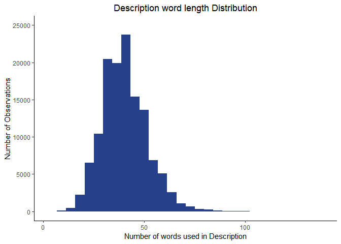
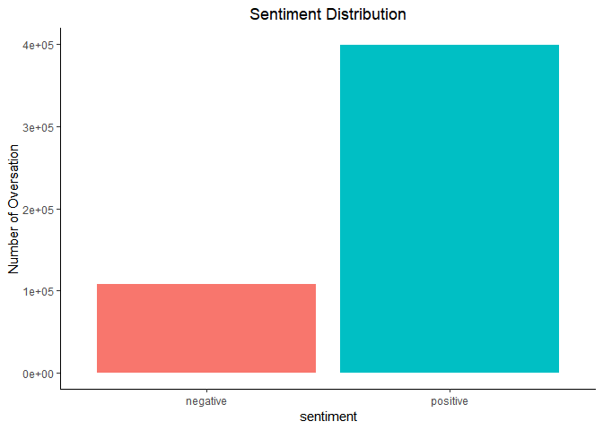
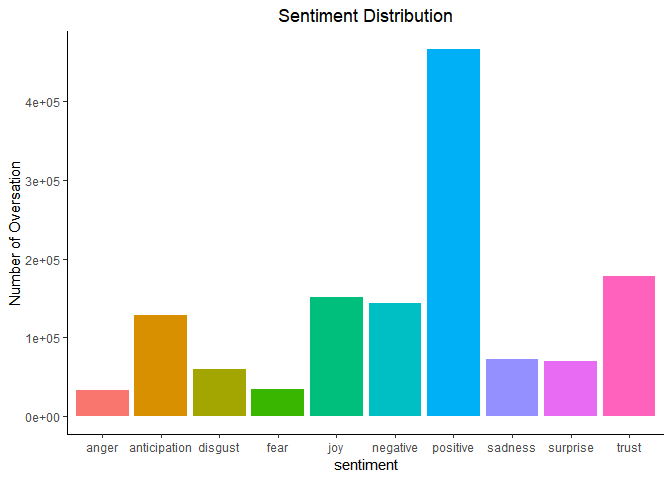
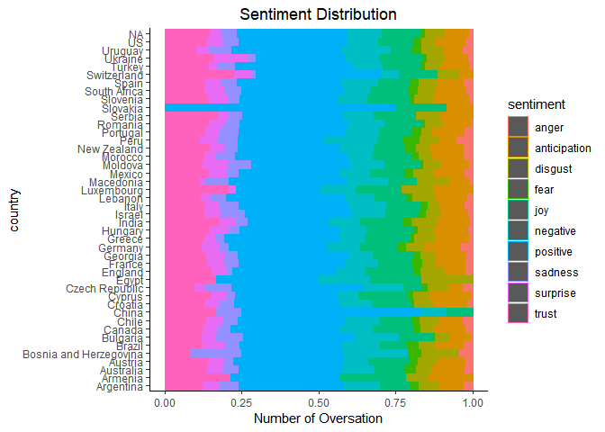
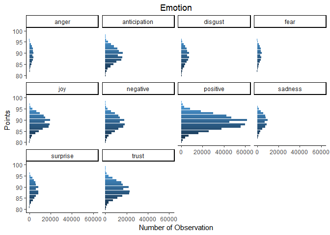
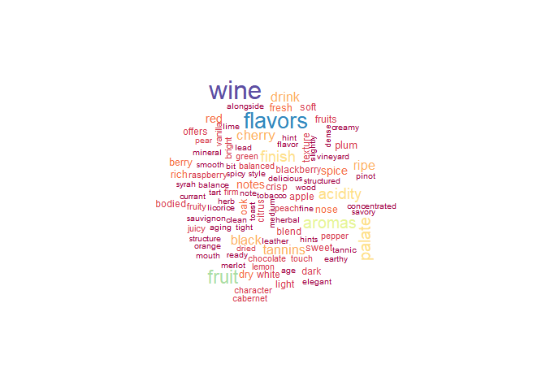

Text Analysis
================

``` r
country.name <- "country"
description.name <- "description"           
designation.name <- "designation"           
points.name <- "points"               
price.name <- "price"                 
province.name <- "province"              
region_1.name <- "region_1"              
region_2.name <- "region_2"             
taster.name <- "taster_name"           
twitter.name <- "taster_twitter_handle" 
title.name <- "title"                 
variaty.name <- "variety"              
winery.name <- "winery"               

dat[,eval(points.name)] <- as.numeric(dat[,get(points.name)])
dat[,eval(price.name)] <- as.numeric(dat[,get(price.name)])

single.var <- c(points.name, price.name, country.name)
```

``` r
# filter data set
subdat <- dat %>%
 select(variaty.name,country.name,points.name,province.name, winery.name,description.name)

head(subdat)
```

    ##               variety  country points          province
    ## 1:        White Blend    Italy     87 Sicily & Sardinia
    ## 2:     Portuguese Red Portugal     87             Douro
    ## 3:         Pinot Gris       US     87            Oregon
    ## 4:           Riesling       US     87          Michigan
    ## 5:         Pinot Noir       US     87            Oregon
    ## 6: Tempranillo-Merlot    Spain     87    Northern Spain
    ##                 winery
    ## 1:             Nicosia
    ## 2: Quinta dos Avidagos
    ## 3:           Rainstorm
    ## 4:          St. Julian
    ## 5:        Sweet Cheeks
    ## 6:              Tandem
    ##                                                                                                                                                                                                                                                              description
    ## 1:                                                                                          Aromas include tropical fruit, broom, brimstone and dried herb. The palate isn't overly expressive, offering unripened apple, citrus and dried sage alongside brisk acidity.
    ## 2:                                   This is ripe and fruity, a wine that is smooth while still structured. Firm tannins are filled out with juicy red berry fruits and freshened with acidity. It's  already drinkable, although it will certainly be better from 2016.
    ## 3:                                                                            Tart and snappy, the flavors of lime flesh and rind dominate. Some green pineapple pokes through, with crisp acidity underscoring the flavors. The wine was all stainless-steel fermented.
    ## 4:                                                               Pineapple rind, lemon pith and orange blossom start off the aromas. The palate is a bit more opulent, with notes of honey-drizzled guava and mango giving way to a slightly astringent, semidry finish.
    ## 5:             Much like the regular bottling from 2012, this comes across as rather rough and tannic, with rustic, earthy, herbal characteristics. Nonetheless, if you think of it as a pleasantly unfussy country wine, it's a good companion to a hearty winter stew.
    ## 6: Blackberry and raspberry aromas show a typical Navarran whiff of green herbs and, in this case, horseradish. In the mouth, this is fairly full bodied, with tomatoey acidity. Spicy, herbal flavors complement dark plum fruit, while the finish is fresh but grabby.

``` r
# count length of 
subdat$descriptioncount <- str_count(string = subdat$description, pattern = '\\S+')
```

``` r
# summary of description length
summary(subdat$descriptioncount)
```

    ##    Min. 1st Qu.  Median    Mean 3rd Qu.    Max. 
    ##    3.00   33.00   39.00   40.38   47.00  135.00

``` r
# Description distribution
ggplot(data = subdat, aes(x = descriptioncount)) + geom_histogram(bins=30, fill = 'royalblue4') + 
 theme_classic() +
 ggtitle('Description word length Distribution') + 
 xlab('Number of words used in Description') + 
 ylab('Number of Observations') + 
 theme(plot.title = element_text(hjust = 0.5)) + 
 ylim(0,25000) 
```

<!-- -->

``` r
# top words 
subdat[, freq_terms(text.var = subdat$description, stopwords = Top200Words)]
```

    ##    WORD     FREQ
    ## 1  wine    78015
    ## 2  flavors 62678
    ## 3  fruit   45012
    ## 4  aromas  39612
    ## 5  palate  38083
    ## 6  acidity 34958
    ## 7  finish  34943
    ## 8  tannins 30853
    ## 9  drink   29958
    ## 10 it's    29893
    ## 11 cherry  27380
    ## 12 ripe    26989
    ## 13 black   25388
    ## 14 notes   19018
    ## 15 red     18852
    ## 16 spice   18778
    ## 17 rich    17274
    ## 18 fresh   16953
    ## 19 nose    16910
    ## 20 oak     16642

``` r
# Sentiment Analysis
subdat %>%
unnest_tokens(output = word, input = description) %>%
inner_join(get_sentiments('bing')) %>%
group_by(sentiment) %>%
count() %>%
ggplot(aes(x=sentiment,y=n, fill=sentiment)) + geom_col() + 
 theme_classic() + guides(fill=F) + 
 ggtitle('Sentiment Distribution') + ylab('Number of Oversation') + 
 ylim(0,400000) + theme(plot.title = element_text(hjust = 0.5)) 
```

    ## Joining, by = "word"

<!-- -->

``` r
# Sentiment Analysis ny country 
subdat %>%
unnest_tokens(output = word, input = description) %>%
inner_join(get_sentiments('bing')) %>%
group_by(country,sentiment) %>%
summarize(n = n())%>%
mutate(proportion = n/sum(n)) %>%
ggplot(aes(x= country, y=proportion,fill=sentiment)) + geom_col() + 
 theme_classic() + guides(fill=F) + coord_flip() + 
 ggtitle('Sentiment Distribution') + ylab('Number of Oversation') + 
 theme(plot.title = element_text(hjust = 0.5)) 
```

    ## Joining, by = "word"

<!-- -->

``` r
# Sentiment Analysis
subdat %>%
unnest_tokens(output = word, input = description) %>%
inner_join(get_sentiments('nrc')) %>%
group_by(sentiment) %>%
count() %>%
ggplot(aes(x=sentiment,y=n, fill=sentiment)) + geom_col() + 
 theme_classic() + guides(fill=F) + 
 ggtitle('Sentiment Distribution') + ylab('Number of Oversation') + 
 #ylim(0,400000) + 
 theme(plot.title = element_text(hjust = 0.5)) 
```

    ## Joining, by = "word"

<!-- -->

``` r
# Sentiment Analysis ny country 
subdat %>%
unnest_tokens(output = word, input = description) %>%
inner_join(get_sentiments('nrc')) %>%
group_by(country,sentiment) %>%
summarize(n = n()) %>%
mutate(proportion = n/sum(n)) %>%
ggplot(aes(x= country, y=proportion,fill=sentiment, col = sentiment)) + geom_col() + 
 theme_classic() + guides(fill=F) + coord_flip() + 
 ggtitle('Sentiment Distribution') + ylab('Number of Oversation') + 
 theme(plot.title = element_text(hjust = 0.5))
```

    ## Joining, by = "word"

<!-- -->

``` r
subdat %>%
unnest_tokens(output = word, input = description) %>%
inner_join(get_sentiments('nrc')) %>%
 group_by(sentiment,points) %>%
 count()%>%
 group_by(sentiment, points) %>%
 summarize(n = mean(n)) %>%
 ungroup() %>%
 ggplot(aes(x=points, y=n, fill=points)) +
  geom_col() + facet_wrap(~sentiment) +
  guides(fill=F) + coord_flip() +theme_classic() + ylab('Number of Observation') + 
  xlab('Points') + ggtitle('Emotion') + 
  theme(plot.title = element_text(hjust = 0.5))
```

    ## Joining, by = "word"

<!-- -->

``` r
# World cloud data 
wordcloudData <- 
 subdat%>%
 unnest_tokens(output = word, input = description) %>%
 anti_join(stop_words)%>%
 group_by(word)%>%
 summarize(freq = n())%>%
 arrange(desc(freq))%>%
 ungroup()%>%
 data.frame()
```

    ## Joining, by = "word"

``` r
wordcloud(words = wordcloudData$word,wordcloudData$freq,scale=c(2,0.5),
          max.words = 100, colors = brewer.pal(10,'Spectral'))
```

<!-- -->

``` r
?brewer.pal()
```

    ## starting httpd help server ... done
